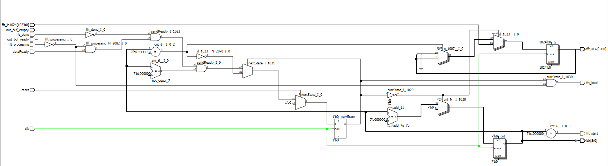
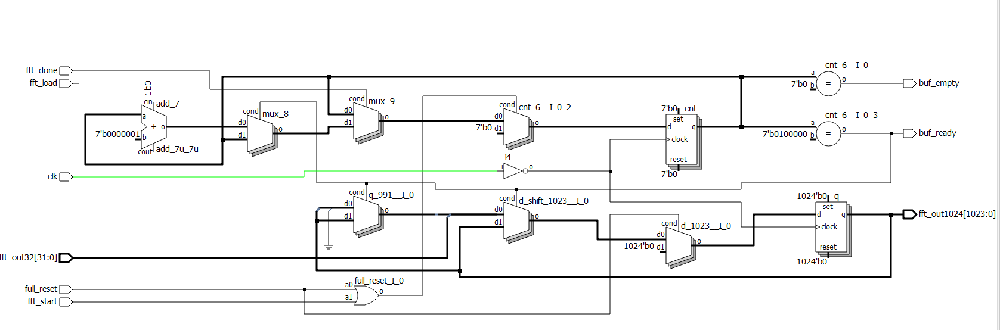

# Design

<<<<<<< HEAD

=======
>>>>>>> 6e345ea4e793666c215b5e89e69b166825074e1f

# MCU Design

The main components of the MCU include the usage of an ADC (Analog to Digital Converter), and the SPI module within the MCU. 

# FPGA Design
