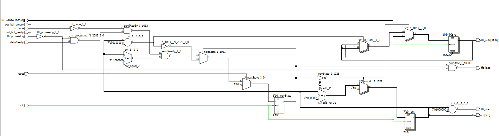
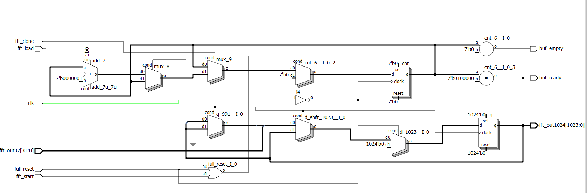
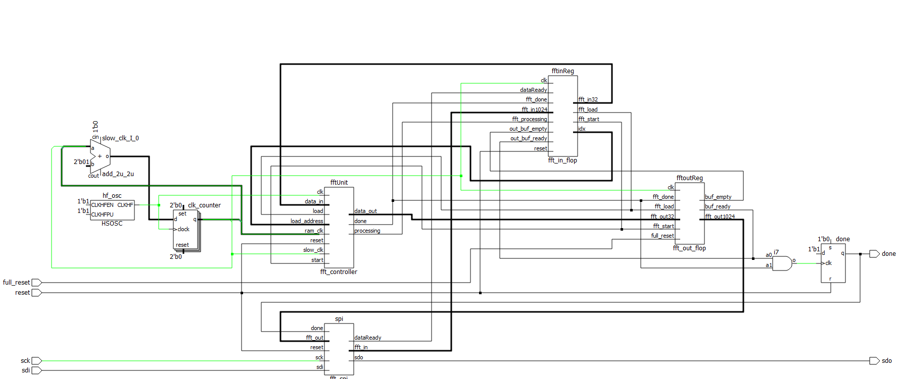

# Design
<!-- Include images of the schematics for your system. They should follow best practices for schematic drawings with all parts and pins clearly labeled. You may draw your schematics either with a software tool or neatly by hand. -->

<figure>

<figcaption> Fig. 1 - FFT Input Buffer RTL design
</figure>
<figure>

<figcaption> Fig. 2 - FFT Output Buffer RTL design
</figure>

<figure>

<figcaption> Fig. 3 - Top-level module
</figure>

# MCU Design
The main components of the MCU include the usage of an ADC (Analog to Digital Converter), and the SPI module within the MCU. The design was relatively straightforward, as it involved setting up the ADC and a SPI unit, then performing calculations on both the audio samples and the frequency spectrum of those samples and piping the dominant frequency to a Timer.

The source code for the project is located in the Github repository [here](https://github.com/brianSimpkins/E155_Final/tree/main/src).

# FPGA Design
The main modules within the FPGA include
1. SPI Transciever
2. 1024 bit input buffer
3. FFT Unit
    * Address Generation
    * RAM Blocks
    * Twiddle generation
    * Fused multiply accumulate
4. 1024 bit output buffer

We began by understanding the single-cycle FFT and how each cycle corresponded with a particular step of the Fast Fourier Transform. Each individual subcomponent of the FFT was then designed in HDL and to validate for correctness was ran against a testbench. Simulations involved run time domain square waves and sine waves and ensuring that their respective discrete fourier transforms yielded correct results. After the FFT was validated, we moved on to design the data transfer unit, which involves a single 1024 bit SPI transciever module and an input/output flops to hold the data between the transfer to/from the FPGA and MCU. First, we designed both the input and output flops that load and then send data to the FFT unit and SPI transciever respectively. After those were validated using a testbench, we then designed the shared shift register SPI module that would send data stored in the output flop to the MCU and send data from the MCU to the input flop. We were able to simulate multiple transactions using a testbench.

