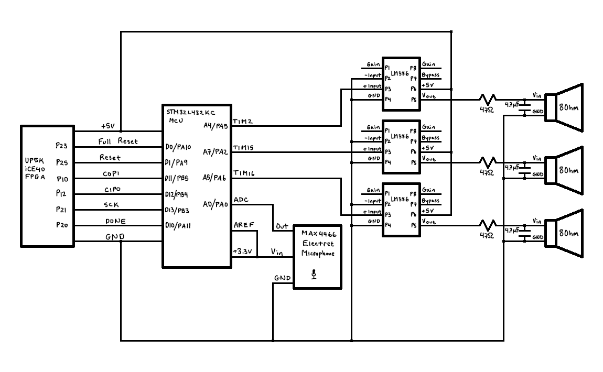

# Schematics
<!-- Include images of the schematics for your system. They should follow best practices for schematic drawings with all parts and pins clearly labeled. You may draw your schematics either with a software tool or neatly by hand. -->

# Source Code Overview
<!-- This section should include information to describe the organization of the code base and highlight how the code connects. -->

The source code for the project is located in the Github repository [here](https://github.com/brianSimpkins/E155_Final/tree/main/src). It is broken up into two directories - the MCU code and the FPGA code.

## __MCU Code__

The code is mostly broken up into individual C and header files which each command a distinct part of the Microcontroller. For example, the "STM32L432KC_ADC.c" file contains code which enables, configures, and interfaces with the Analog to Digital Converter on the Microcontroller. All of these files are included by "main.c", which encodes all of the logic required to sample from the ADC on time, communicate with the FPGA, calculate the fundamental frequency of the input, and finally play the notes.

## __FPGA Code__

The FPGA code is also broken up into individual files, though not as distinctly as the MCU code. The modules which encode the hardware for the Fast Fourier Transform are contained in "fft_controller.sv", "memory_units.sv", "multiplication.sv", and "address_gen.sv". The modules which support all data transmission, including the SPI protocol and the system which holds the input and output data, are located in "spi.sv". Finally, "fft.sv" contains the logic required to piece the entire system together. 

# New Hardware Description

The only hardware used that wasn't provided by the HMC stockroom was an Adafruit Electret Microphone Amplifier. The amplifier contains a trimmer pot which can be used to adjust the gain. For interfacing with the MCU, setting the maximum gain is optimal. The breakout board contains three pins - one for Vcc, one for Ground, and one for the microphone output. The output varies between Vcc and 0, and is centered at Vcc/2. 

# Bill of Materials
<!-- The bill of materials should include all the parts used in your project along with the prices and links.  -->

| Item | Part Number | Quantity | Unit Price | Link |
| ---- | ----------- | ----- | ---- | ---- |
| Electret Microphone Amplifier - MAX4466 with Adjustable Gain |  1063 | 1 | $6.95 |  [link](https://www.adafruit.com/product/1063) |

**Total cost: $6.95**
